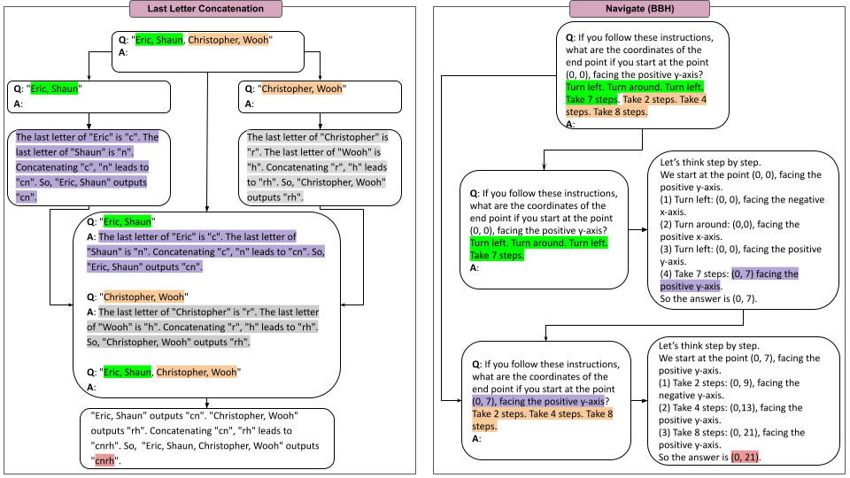

# Official Repo of Tree of Problems (ToP)

Official implementation of [Tree of Problems: Improving structured problem solving with compositionality](https://arxiv.org/abs/2410.06634) with code, prompts and model outputs.



# Table of Contents
1. [Overview of the Tree of Problems (ToP) framework](#overview)
2. [Installation](#installation)
3. [Experiments](#our-approach)
    - [Main Experiments](#main-experiments)
    - [Get Started](#get-started)
        - [GoT Tasks](#got-tasks)
        - [Last Letter Concatenation](#last-letter-concatenation)
        - [Canonical BBH Tasks](#canonical-bbh-tasks)
    - [Complementary experiments](#complementary-experiments)
        - [Sequential Tasks](#sequential-tasks)
        - [Coin Flip](#coin-flip)
        - [Sequential BBH Tasks](#sequential-bbh-tasks)
4. [Evaluation](#evaluation)
5. [Add a new task](#how-to-add-a-new-task)
6. [Acknowledgements](#acknowledgments)
7. [Citations](#citations)

# Overview

The Tree of Problems (ToP) framework is designed to help LLMs to solve complex problems which can be divided into multiple identical instances. As opposed to related techniques such as Tree-of-Thoughts (ToT) and Graph-of-Thoughts (ToT), it is based on subproblems instead of reasoning steps. That inherently limits its applicability to a smaller range of problems, however, it emerges as the one of the best alternative for the class of problems it is compatible with. The idea is simply to propagate the ability of LLMs to solve smaller instances of a problem to more complicated ones. We discern to type of tasks:
- **Canonical tasks**: instances of these tasks can be divided into identical and **independent** subinstances. $ToP$ thus uses an approach similar to divide-and-conqueer. It builds a tree of all the instances and hierarchically solve them all in a bottom-up approach until the main instance is solved. As explained in the paper, ToP requires a decomposer, a solver and the merger. The role of the decomposer is basically to build the tree of problems, it indicates how a problem instances can be divided into subinstances. The solver is an LLM with a `solve_prompt` while the merger is an LLM with a `merge_prompt`. 
- **Sequential tasks**: The tasks can be divided into identical subtasks but each subtask depend on the solution of its predecessor. Typical examples involve finding the final state of a system after a series of processing steps. 

$ToP$ depends on two parameters: the breadth $b$ and the depth $d$. The breadth indicates in how many subinstances to divide a given instance. The depth indicates how many times the decomposition should be performed. Applying the Tree of Problems with a breadth $b$ and a depth $d$ is written $ToP~(b, d)$.

# Installation

This repository supports the application of $ToP$ to open-source models via [vLLM](https://github.com/vllm-project/vllm) and [Transformers](https://github.com/huggingface/transformers). It also supports OpenAI models via their API.

Before using this repository, make sure to install [PyTorch](https://pytorch.org/get-started/locally/) in accordance to the characteristics of your device. The rest of the required libraries can be installed via

```
git clone https://github.com/ArmelRandy/tree-of-problems
cd tree-of-problems/
pip install -r requirements.txt
```

# Experiments

## Main experiments

We successfully applied ToP to three tasks borrowed from [Graph of Thoughts](https://arxiv.org/abs/2308.09687) (GoT tasks): *Sorting*, *Set Intersection* and *Keyword Counting*. *Sorting* ask an LLM to sort a 32-element list of integers in [0, 9]. *Set Intersection* requires to find the intersection of 2 32-element sets. *Keyword Counting* requires an LLM to identify all the countries in a text and report their number of occurrences. These are all canonical tasks.
- Given a list $L$ to sort, we can divide it into $L_1 = L[0:len(L)//2]$ and $L_2 = L[len(L)//2:]$. We then sort $L_1$ and $L_2$ (with the *solver*) and we merge the two resulting lists to obtain the sorted version of $L$.
- Given two sets $A$ and $B$, finding $A\cap B$ can be done in many ways. You can divide $A$ into $A_1 \cup A_2$ and $B$ into $B_1\cup B_2$ such that $A_1 \cap A_2 = B_1 \cap B_2 = \emptyset$. We then have $A\cap B = (A_1 \cup A_2)\cap B = (A_1\cap B)\cup (A_2 \cap B)$ or $A\cap B = (A_1\cap B_1)\cup (A_2 \cap B_1) \cup (A_1\cap B_2)\cup (A_2 \cap B_2)$. The former decomposition amount to using a breadth of 2 while the latter requires a breadth of 4. In both cases, the merge operation is equivalent to a union of sets.
- Given a paragraph $P$ with $L$ sentences, we can divide it into 2 paragraphs, $P_1$ with the first $L//2$ sentences and $P_2$ with the $L - L//2$ remaining. Counting the countries and their occurrences in $P$ is equivalent to do it for $P_1$ and $P_2$ and then merge the 2 dictionaries obtained.

Moreover, *Last Letter Concatenation*, consisting into concatenating the last letters of a list of $L$ words is also a canonical tasks. We also applied $ToP$ to 5 canonical [BBH](https://arxiv.org/abs/2210.09261) tasks: *Boolean expressions*, *Object Counting*, *Hyperbaton*, *Multistep Arithmetic Two* and *Word Sorting*.

$ToP~(2, 1)$ worked well for those, meaning that each instance is divided into 2 independent ones, and this operation is done only once. We found a breadth of 2 to give very satisfactory results in general. A high depth can signicantly improve $ToP$'s performance.

## Get started

Check [scripts](scripts) and [parameters](scripts/parameters/run.txt). Beware of trailing spaces in the example commands.

### GoT tasks

Here is the command to apply $ToP~(2, 1)$ with `gpt-4o-mini-2024-07-18` on `sorting`. `--number_of_subproblems` indicates the breadth and `--steps` the depth. `--method_prompt` should be `standard` or `cot`. You can change the task by setting `--problem_name` to `set_intersection` or `keyword_counting`. You have to specify with the argument `--api_key`.

```
python main.py\
    --model_name_or_path gpt-4o-mini-2024-07-18\
    --tokenizer_name_or_path gpt-4o-mini-2024-07-18\
    --dataset_name_or_path got\
    --request_batch_size 16\
    --inference_api openai\
    --api_key <api key>\
    --do_sample\
    --max_samples 100\
    --num_return_sequences 1\
    --num_beams 1\
    --max_new_tokens 2000\
    --temperature 0.0\
    --top_p 1.0\
    --repetition_penalty 1.0\
    --output_dir ./reasoning\
    --k 3\
    --seed 122\
    --problem_name sorting\
    --method_prompt cot\
    --steps 1\
    --number_of_subproblems 2\
    --verbose\
```

If you want to use an open-source model (e.g. [LLaMA 3 70B AWQ](https://huggingface.co/casperhansen/llama-3-70b-instruct-awq)), you can do it by specifying `--inference_api vllm`. If the model is instruction-tuned, make sure that its template is supported in [apply_template](top/models.py#L74).

### Last Letter Concatenation

In [tree-of-problems/top/concatenation/data](top/concatenation/data), there are 3 files, each containing 500 instances of LLC for 4, 8 and 16 words. You can apply $ToP(2, 1)$ with `gpt-3.5-turbo-instruct` on 16-word lists using the following:

```
python main.py\
    --model_name_or_path gpt-3.5-turbo-instruct\
    --tokenizer_name_or_path gpt-3.5-turbo-instruct\
    --dataset_name_or_path concatenation_16.csv\
    --request_batch_size 16\
    --inference_api openai\
    --api_key <api key>\
    --do_sample\
    --max_samples 100\
    --num_return_sequences 1\
    --num_beams 1\
    --max_new_tokens 2000\
    --temperature 0.0\
    --top_p 1.0\
    --repetition_penalty 1.0\
    --output_dir ./reasoning/16\
    --k 8\
    --seed 122\
    --problem_name concatenation\
    --method_prompt cot\
    --steps 1\                                     <- depth
    --number_of_subproblems 2\                     <- breadth
    --verbose\
```

We ran experiments to compare $ToP$ to Least-to-Most prompting (L2M) on the Last Letter Concatenation task. Given a list of $L$ names, L2M concatenates the 2 first last letters and recursively add the last letter of the remaining words in the list. L2M is slightly similar to $ToP~(1, L-1)$ and then applying $L2M$ requires to add `--l2m` and use $b = 1$ and $d = L-1$.

```
    --steps 15\                                    <- depth
    --number_of_subproblems 1\                     <- breadth
    --verbose\
    --l2m\
```

You can use similar commands for the [algebraic task](top/algebraic/) (Computing the algebraic sum of up to 16 3-digit numbers) with `--problem_name algebraic` and `dataset_name_or_path algebraic_16_3.csv`.

### Canonical BBH tasks

The names of the 5 canonical BBH tasks are `boolean_expressions`, `hyperbaton`, `multistep_arithmetic_two`, `object_counting` and `word_sorting`. For example, you can apply $ToP(2, 1)$ with `gpt-3.5-turbo-instruct` on `object_counting` using the following:

```
python main.py\
    --model_name_or_path gpt-3.5-turbo-instruct\
    --tokenizer_name_or_path gpt-3.5-turbo-instruct\
    --dataset_name_or_path bbh\
    --request_batch_size 16\
    --inference_api openai\
    --api_key <api key>\
    --do_sample\
    --max_samples 100\
    --num_return_sequences 1\
    --num_beams 1\
    --max_new_tokens 2000\
    --temperature 0.0\
    --top_p 1.0\
    --repetition_penalty 1.0\
    --output_dir ./reasoning\
    --k 3\
    --seed 122\
    --problem_name object_counting\
    --method_prompt cot\
    --steps 1\                                     <- depth
    --number_of_subproblems 2\                     <- breadth
    --verbose\
```

## Complementary experiments

### Sequential Tasks

The Tree of Problems framework also allows solve sequential problems. Given a problem where we need to find the state of a system after $m$ processing steps ($p_1 \ldots p_m$) from the initial state $s_0$ i.e. $State(s_0, \{p_1, \ldots p_m\})$,
we can apply $ToP~(1, k)$ and divide the $m$ processing steps into $k$ blocks $K_1, \ldots K_k$ with either $\lfloor \frac{m}{k} \rfloor$ or $\lceil \frac{m}{k} \rceil$ steps. Each block represents a subproblem, $K_1 = \{p_1, \ldots p_{\lceil \frac{m}{k} \rceil} \}, \ldots, K_k = \{p_{m - \lfloor \frac{m}{k} \rfloor + 1}, \ldots p_m\}$. We then have

```python
init_state = s_0
for j in range(k):
    init_state = State(init_state, K_{j+1})
final_state = init_state
```

Using $k = 1$ is equivalent to directly solving the problem (with CoT or IO prompting). For these problems, the LLM is no longer required to merge subproblems' solutions. The tree of problems is a [path graph](https://en.wikipedia.org/wiki/Path_graph) and the problem instance to solve is automatically computed based its predecessor's solution without the intervention of the LLM.

### Coin flip

Let's apply $ToP~(1, 2)$ on 16-people coin flip instances:
```
python main.py\
    --model_name_or_path gpt-3.5-turbo-instruct\
    --tokenizer_name_or_path gpt-3.5-turbo-instruct\
    --dataset_name_or_path coin_16.csv\
    --request_batch_size 16\
    --inference_api openai\
    --api_key <api key>\
    --do_sample\
    --max_samples 100\
    --num_return_sequences 1\
    --num_beams 1\
    --max_new_tokens 2000\
    --temperature 0.0\
    --top_p 1.0\
    --repetition_penalty 1.0\
    --output_dir ./reasoning\
    --k 8\
    --seed 122\
    --problem_name coin\
    --method_prompt cot\
    --steps 2\                                     <- depth
    --number_of_subproblems 1\                     <- breadth
    --verbose\
```

### Sequential BBH tasks

Let's apply $ToP~(1, 2)$ to instances of `tracking_shuffled_objects_three_objects`:
```
python main.py\
    --model_name_or_path gpt-3.5-turbo-instruct\
    --tokenizer_name_or_path gpt-3.5-turbo-instruct\
    --dataset_name_or_path bbh\
    --request_batch_size 16\
    --inference_api openai\
    --api_key <api key>\
    --do_sample\
    --max_samples 100\
    --num_return_sequences 1\
    --num_beams 1\
    --max_new_tokens 2000\
    --temperature 0.0\
    --top_p 1.0\
    --repetition_penalty 1.0\
    --output_dir ./reasoning\
    --k 3\
    --seed 122\
    --problem_name tracking_shuffled_objects_three_objects\
    --method_prompt cot\
    --steps 2\                                     <- depth
    --number_of_subproblems 1\                     <- breadth
    --verbose\
```
You can change `--problem_name` to `navigate`, `web_of_lies`, `tracking_shuffled_objects_five_objects` or `tracking_shuffled_objects_seven_objects`. For `L` objects, you can use a depth of at most `L`.

# Evaluation

We handle the evaluation separately in the notebook `evaluation.ipynb`. This allows to evaluate multiple setups at the same time and to verify if the post-processing is done correctly.

# How to add a new task?

In order to add a new task, you should create a folder `<task name>` in `top`. It will have the following structure:

```                 
├── <task name>/                    
│     ├── prompts/
│     │   ├──cot             <- CoT prompts
│     │   ├──standard        <- Input-Output (IO) prompts
│     │   ├──divide          <- Decomposition prompts
│     │   ├──merge           <- Merge prompts
│     ├── data/              <- Folder with the dataset (if applicable)
│     ├── __init__.py
│     ├── dataset.py
│     ├── divide.py 
│     ├── merge.py           
│     └── solve.py
```

`dataset.py` indicates how to construct a problem instance from the data. `divide.py`, `merge.py` and `solve.py` contain the functions required for each step of the ToP framework. Each of them will be called in the corresponding file in [tree-of-problems/top](top/).

# Acknowledgments

This work was made possible by the INRIA Paris' NLP research team, [ALMAnaCH](https://almanach.inria.fr/index-en.html).

We thank Maciej Besta for answering our questions regarding Graph of Thoughts.

# Citations

If you find this repository valuable, please give it a star!

Please cite the following if you use the data or code in this repository.

```
@misc{zebaze2024treeproblemsimprovingstructured,
      title={Tree of Problems: Improving structured problem solving with compositionality}, 
      author={Armel Zebaze and Benoît Sagot and Rachel Bawden},
      year={2024},
      eprint={2410.06634},
      archivePrefix={arXiv},
      primaryClass={cs.CL},
      url={https://arxiv.org/abs/2410.06634}, 
}
```
